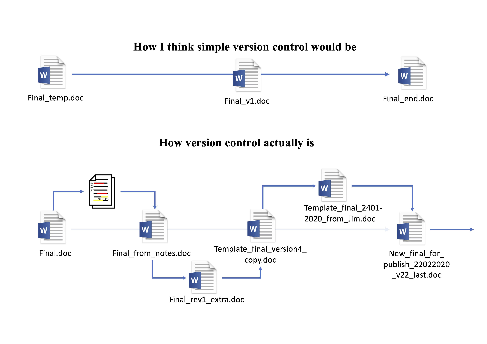
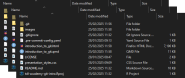
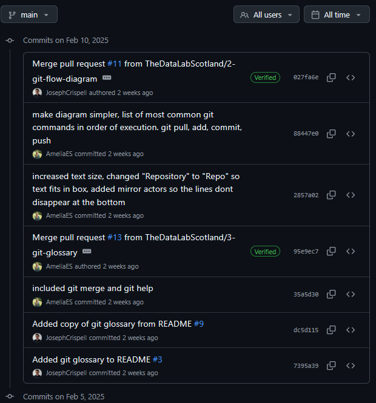
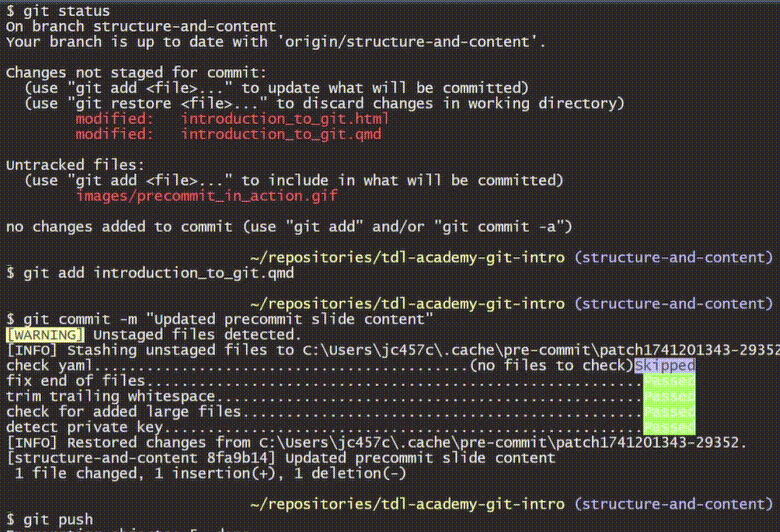

## Our `git` backgrounds

## Amelia

- Post-doc at the University of Edinburgh using epidemiological and statistical methods for mental health research.

<!-- Idea for an illustration to show the sorts of things I use git/github for in my job -->

```{mermaid}

%%{init: {
  'theme': 'base',
  'gitGraph': {
    'showBranches': true,
    'showCommitLabel':false
  },
  'themeVariables': {
    'tagLabelFontSize': '18px'
  }
}}%%


gitGraph
   commit tag: "PhD/post-doc"

   branch data-analysis
   commit tag: "R"
   commit tag: "Python"

   checkout main
   branch reproducible-pipelines
   commit tag:"nextflow"

   checkout main
   branch github-actions
   commit tag:"testing"
   commit
   commit tag:"GitHub pages"

   checkout main
   merge data-analysis
   merge reproducible-pipelines
   merge github-actions

```

## Joe

<br>

::: columns
::: {.column width="60%"}

- Pathogen transmission using genomics
- Continued at University College Dublin
- Data science in international development
- Data science in University Services
:::

::: {.column width="40%"}

{width="60%" fig-align="right"}

:::
:::

## Version control

[{width=70% fig-align="center"}](https://r-cubed-intro.rostools.org/sessions/version-control)

<div style="font-size: 0.5em; text-align: right; margin-top: -5%;">
  *Image taken from [Intro to Reproducible Research in R](https://r-cubed-intro.rostools.org/sessions/version-control)
</div>

::: {.notes}
- you would think version control/making changes to a file is a simple linear process.
- it's also not ideal as you're saving multiple copies of the same file with sometimes very small differences between them
- but in reality it can be a messy process, with additions to the file coming from different sources
- this manual way of keeping track of changes to files is manual, error prone and time consuming
:::

## What is `git`?

"You use git to take snapshots of all the files in a folder."

[*Alice Bartlett*](https://speakerdeck.com/alicebartlett/git-for-humans)

{width="95%" height="auto"}

::: {.notes}
Slide from Joe's make_git_happen
:::

## Snapshots in time

<br>

{width="100%" height="auto"}

## Snapshots in time

<br>

{width="100%" height="auto"}

## Snapshots in time

::: columns
::: {.column width="50%"}


:::

::: {.column width="50%"}

<br>

A record of:

- **What** changes were made
- **Who** made them
- **When** they made them

:::
:::

##
### `git` branch = a working version of your folder


```{mermaid}
%%{init: {
  'theme':'base',
  'gitGraph': {
    'showBranches': true,
    'showCommitLabel':false
  },
  'themeVariables': {
    'tagLabelFontSize': '18px'
  }
}}%%

gitGraph
   commit
   commit

   %% step 1
   branch initial_content
   commit
   commit
   commit
   commit

   %% step 1
   checkout main
   merge initial_content

   branch 3-git-glossary
   checkout 3-git-glossary
   commit
   commit
   commit

   branch 2-git-flow-diagram
   checkout 2-git-flow-diagram
   commit
   commit

   checkout 3-git-glossary
   merge 2-git-flow-diagram

   checkout main
   merge 3-git-glossary
```

## Key concepts

::: columns
::: {.column width="80%"}
<br>

- **Repository** - your project folder
- **Commit** - snapshot of your folder
- **Branch** - working version of your folder
- **Collaboration** - working together on codebase with [GitHub](https://github.com/)/[GitLab](https://about.gitlab.com/)/[Azure DevOps](https://azure.microsoft.com/en-us/products/devops)/...
:::

::: {.column width="20%"}

{.absolute width=auto height=70%}

:::
:::

## Key concepts

::: columns
::: {.column width="80%"}
<br>

- **Repository** - your project folder
- **Commit** - snapshot of your folder
  * We `push` snapshots online
  * And `pull` other's snapshots to local
- **Branch** - working version of your folder
- **Collaboration** - working together on codebase
:::

::: {.column width="20%"}

{.absolute width=auto height=70%}

:::
:::

## What is GitHub?

_**GitHub** is a cloud-based platform for hosting `git` repositories_

<br>

Features include:

- [Pull Requests](https://github.blog/developer-skills/github/beginners-guide-to-github-creating-a-pull-request/): Propose changes, review, and discuss before merging branches.
- [Issues and Projects](https://github.com/features/issues): Track bugs, tasks, and enhancements.
- [Actions](https://github.com/features/actions): Automate workflows eg. testing, deployment & CI/CD.
- [Pages](https://pages.github.com/): Host websites directly from repositories.

::: {.notes}
Is this the best place for this slide?
GitHub is first introduced in "Collaboration" point in "Key concepts" slide.
:::

## Difference between `git` and GitHub

- `git` is a version control system tracking changes to your code locally.
- **GitHub** is a cloud-based platform for hosting `git` repositories.

## `git` commands

```{mermaid}
sequenceDiagram
  box Local
  participant workspace
  participant index
  participant localRepo as Local Repo
  end
  box Remote
  participant remoteRepo as Remote Repo
  end

  remoteRepo->>workspace: git pull
  workspace->>index: git add
  index->>localRepo: git commit
  localRepo->>remoteRepo: git push

  %%{
    init:{
        'theme':'neutral',
        'themeCSS':'.messageLine0:nth-of-type(1) {stroke: #ff6614; stroke-width: 5px; }.messageLine0:nth-of-type(2) { stroke: #ffab24; stroke-width: 5px; }.messageLine0:nth-of-type(3) { stroke: #22a7d4; stroke-width: 5px; }.messageLine0:nth-of-type(4) { stroke: #23ad94; stroke-width: 5px; }.messageLine0:nth-of-type(5) { stroke: #8aa825; stroke-width: 5px; }.messageLine0:nth-of-type(6) { stroke: brown; stroke-width: 5px; }.messageLine0:nth-of-type(7) { stroke: #8c3ab5; stroke-width: 5px; }.messageLine0:nth-of-type(8) { stroke: #999999; stroke-width: 2px; }.messageText:nth-of-type(1) { fill: black; font-size: 20px !important; font-weight: bold; }.messageText:nth-of-type(2) { fill: black; font-size: 20px !important; font-weight: bold; }.messageText:nth-of-type(3) { fill: black; font-size: 20px !important; font-weight: bold; }.messageText:nth-of-type(4) { fill: black; font-size: 20px !important; font-weight: bold; }.messageText:nth-of-type(5) { fill: black; font-size: 20px !important; font-weight: bold; }.messageText:nth-of-type(6) { fill: black; font-size: 20px !important; font-weight: bold; }.messageText:nth-of-type(7) { fill: black; font-size: 20px !important; font-weight: bold; } #arrowhead path {stroke-width: 4px;}.actor rect { font-size: 40px !important; } text.actor {fill: black; font-size: 25px !important; font-weight: bold;}'
        }
    }%%
  %%{
    init: { 'sequence': {'mirrorActors':true} }
  }%%

%% annoyingly I can't figure out a way to increase text size of the words: workspace, index, local repo and remote repo

```

## `git` command glossary

<div style="height:75%;overflow:auto;">

|Command                                                  |Definition                                                                                                                                                                            |
|---------------------------------------------------------|--------------------------------------------------------------------------------------------------------------------------------------------------------------------------------------|
|`git status`                                             |Check current status of local repository - is it up to date?                                                                                                                          |
|`git pull`                                               |Pull changes from GitHub to local repository                                                                                                                                          |
|`git add [FileName]`                                     |Stage file for committing                                                                                                                                                             |
|`git commit -m [message]`                                |Commit staged changes to GitHub. Always add meaningful message.                                                                                                                       |
|`git push`                                               |Push committed changes to GitHub                                                                                                                                                      |
|`git fetch`                                              |Get latest version references for repository                                                                                                                                          |
|`git stash`                                              |Stash changes so that I can send to different branch ( I use when I forgot to switch branches before making change. Run this command - then switch to branch - then run command below)|
|`git stash pop`                                          |Unstash changes that were previously stashed (Used in combination with command above to move changes onto different branch)                                                           |
|`git branch`                                             |List existing branches                                                                                                                                                                |
|`git branch [branchName]`                                |Create new branch                                                                                                                                                                     |
|`git push --set-upstream origin [branchName]`            |Push a branch online                                                                                                                                                                  |
|`git branch -d [branchName]`                             |Delete branch                                                                                                                                                                         |
|`git checkout [branchName]`                              |Switch to branch                                                                                                                                                                      |
|`git checkout -t origin/[branchName]`                    |Switch to remote branch (note you'll need to run git fetch first)                                                                                                                     |
|`git merge [branchName]`                                 |Merge changes from one branch to another                                                                                                                                              |
|`git rm [fileName]`                                      |Remove file and record                                                                                                                                                                |
|`git mv [fileName]`                                      |Move file and version history within repository                                                                                                                                       |
|`git reset`                                              |Remove any staged/added files                                                                                                                                                         |
|`git diff [fileName]`                                    |Check for any changes in a file compared to when the file last had a commit associated with it                                                                                        |
|`git add --patch`                                        |Select a particular change within a file to stage/add and commit                                                                                                                      |
|`git --help`                                             |Get help on any git command                                                                                                                                                           |


</div>

## `git` pre-commit

::: columns
::: {.column width="40%"}
<br>

Check out [pre-commit](https://pre-commit.com/) hooks as a way to automatically run checks
:::

::: {.column width="60%"}



:::
:::

## `git` pre-commit

::: columns
::: {.column width="40%"}
<br>

Check out [pre-commit hooks](https://pre-commit.com/) as a way to automatically run checks
:::

::: {.column width="60%"}

<br>

```{.yaml code-line-numbers="4-10"}
repos:
-   repo: https://github.com/pre-commit/pre-commit-hooks
    rev: v4.4.0
    hooks: # info on support hooks here: https://pre-commit.com/hooks.html
    -   id: check-yaml # checks .yaml file formatting
    -   id: end-of-file-fixer # adds empty line at end of file
    -   id: trailing-whitespace # removes extra white space
    -   id: check-added-large-files # doesn't allow files more than 500Kb (configurable)
        args: ['--maxkb=5000']
    -   id: detect-private-key # detects the presence of private keys
```

:::
:::


## Useful resources

::: columns
::: {.column width="80%"}
- [Introduction to GitHub](https://docs.github.com/en/get-started/start-your-journey/hello-world)
- GitHub [documentation](https://docs.github.com/en) pages
- A [game](https://learngitbranching.js.org/) to help us think about git branches
- See this `git` in the command line [tutorial](https://git-scm.com/book/en/v2/Getting-Started-The-Command-Line)
- Check out the [`git` handbook](https://guides.github.com/introduction/git-handbook/)
- [`git` glossary](https://github.com/TheDataLabScotland/tdl-academy-git-intro/tree/main?tab=readme-ov-file#git-command-glossary) of commands to remember
- Check out [`git` flow](https://www.alexhyett.com/git-flow-github-flow/) for collaboration
- Version control [guidance](https://best-practice-and-impact.github.io/qa-of-code-guidance/version_control.html) from UK from ONS
:::

::: {.column width="20%"}

<br>
<br>


